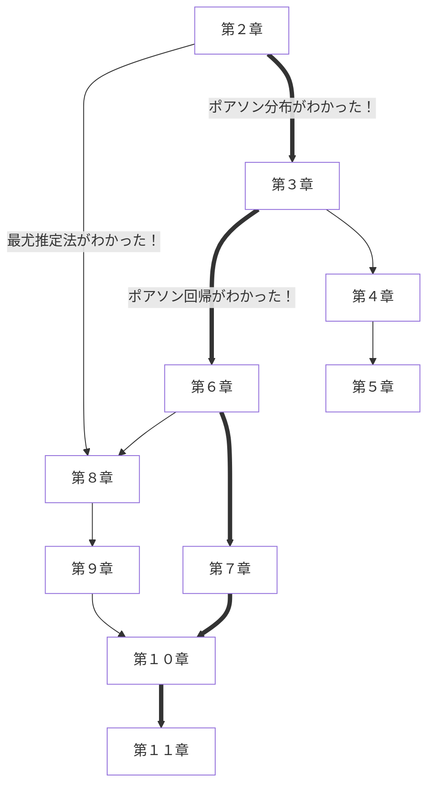

```mermaid
flowchart TD;
    2["第２章"] --"最尤推定法がわかった！"--> 8["第８章"];
    2 --"ポアソン分布がわかった！"---> 3["第３章"];
    3 --"ポアソン回帰がわかった！"---> 6["第６章"];
    6 --> 8;
    6 --> 7["第７章"];
    7 --> 10["第１０章"];
    10 --> 11["第１１章"];
    3 --> 4["第４章"];
    4 --> 5["第５章"];
    8 --> 9["第９章"];
    9 --> 10;

    style 2  fill:white;
    style 3  fill:white;
    style 4  fill:white;
    style 5  fill:white;
    style 6  fill:white;
    style 7  fill:white;
    style 8  fill:white;
    style 9  fill:white;
    style 10  fill:white;
    style 11  fill:white;
    linkStyle 1 stroke-width:5px;
    linkStyle 2 stroke-width:5px;
    linkStyle 4 stroke-width:5px;
    linkStyle 5 stroke-width:5px;
    linkStyle 6 stroke-width:5px;

```

# データを理解するために統計モデルを作る

## 1. 統計モデル：なぜ「統計」な「モデル」？

## 2. 「ブラックボックスな統計解析」の悪夢

## ３. この本の内容：一般化線形モデルの導入とそのベイズ的な拡張

