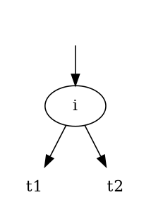
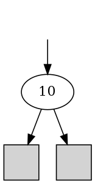
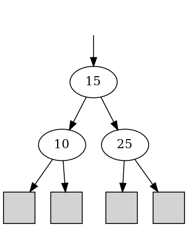
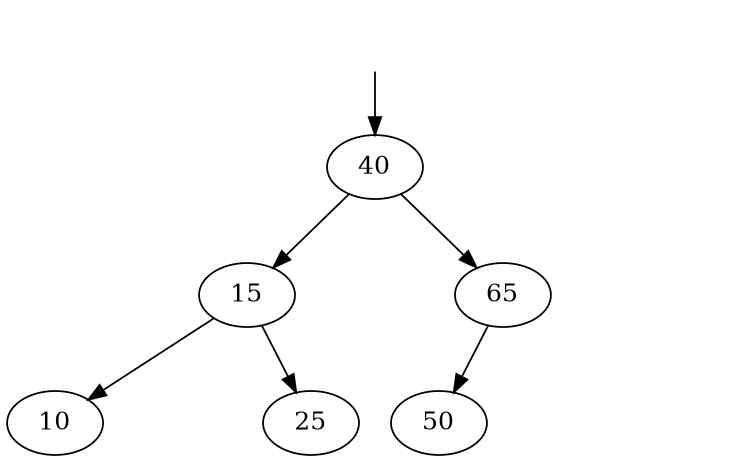

## ２分木

> 以下の規則で構成されるものを**２分木 (binary tree)**という
> - `leaf`は２分木である
 > - ２分木$t_{1},t_{2}$と整数$i$に対し、`branch(`$t_{1},i,t_{2}$`)`は２分木である

`leaf`:子を持たないノード

```dot
digraph leaf {
    graph [
      size="1,1"
    ]
    S [shape=none, label=" "]
    L [shape=square, label=" ", style=filled]
    S -> L
}
```


`branch(`$t_{1},i,t_{2}$`)`：整数を格納した２つの子(部分木)を持つノード




#### ２分木の例
$t_{a} =$ `branch(leaf, 10, leaf)`



$t_{b} = $`branch(`$t_{a}$ `,15, branch(leaf, 25, leaf)`<br>
(=`branch(branch(leaf, 10, leaf),15,branch(leaf, 25, leaf))`)


図を書く場合は`leaf`を省略する場合もある

$t_{c} = $ `branch(` $t_{b}$`, 40, branch(branch(leaf, 50, leaf), 65, leaf)`



#### ２分木上の関数

$size(t)$<br>
木のサイズ（`branch`の数）を表す

再帰的定義<br>
$$
\begin{array}{lcl}
size(\texttt{leaf}) &=& 0 \\
size(\texttt{branch(}t_1\texttt{,} i\texttt{,} t_2\texttt{)}) &=& size(t_1) + size(t_2) + 1 \\
\end{array}
$$

$depth(t)$<br>木の深さ（根から各葉までに通過する`branch`の数の最大）を表す

再帰的定義<br>
$$
\begin{array}{lcl}
depth(\texttt{leaf}) &=& 0 \\
depth(\texttt{branch(}t_1\texttt{,} i\texttt{,} t_2\texttt{)}) &=& max(depth(t_{1}),depth(t_{2})) + 1 \texttt{ ?? }\\
\end{array}
$$


## ２分探索木
**２分探索木 (binary search tree)** 
- 大小関係(正確には全順序集合)の集まりを表すためのデータ構造
- ノードに格納されたデータが以下の条件（２分探索木の**不変条件 (invariant condition)** と呼ぶ）を満たすような特殊な２分木
> 任意の`branch(`$t_{1}$`,`$i$`,`$t_{2}$`)`について、部分木$t_{1}$に現れる任意の整数$j$について$j<i$ かつ部分木$t_{2}$に現れる任意の整数$k$について$i<k$ が成立する


要素の
- **探索(find)**
- **挿入(insert)**
- **削除(delete)**

操作を行うことができる


#### 探索

２分探索木の条件より、根に格納された整数と探索する整数の大小関係によってどちらかの部分木は探索対象から外すことができる。

再帰的定義<br>
$$
\begin{array}{lcl}
find(\texttt{leaf}, i) &=& \textit{false} \\
find(\texttt{branch(}t_1\texttt{,}j\texttt{,} t_2\texttt{)}, i) &=& \left\{\begin{array}{ll}
     \textit{true} & (\text{if } i=j) \\
     find( t_2, i) & (\text{if } i > j) \\
     find( t_1, i) & (\text{if } i < j) \end{array}\right.
\end{array}
$$


疑似コード<br>
```
find(t, i)
    if t is leaf then return false
    else if t is branch(t1, j, t2) then
        if i = j then return true
        else 
            if i < j then return find(t1, i)
            else return find(t2, i)
```


#### 挿入

1. 探索の手順で挿入対象のノード$i$を見つける
2. 葉にたどり着いたら新しいノードで置き換える


再帰的定義<br>
$$
\begin{array}{lcl}
insert(\texttt{leaf}, i) &=& \texttt{branch(leaf,} i \texttt{,leaf)} \\
insert(\texttt{branch(}t_1\texttt{,} j\texttt{,} t_2\texttt{)}, i) &=& \left\{\begin{array}{ll}
     \fbox{ ?? }         & (\text{if } i=j) \\
     ...insert(t_2, i)... & (\text{if } i > j) \\
     ...insert(t_1, i)... & (\text{if } i < j) \end{array}\right.
\end{array}
$$


疑似コード<br>
```
insert(t, i)
    if t is leaf then replace t with branch(leaf, i, leaf) and return
    else if t is branch(t1, j, t2) then
        if i = j then return
        else 
            if i < j then insert(t1, i)
            else insert(t2, i)
```


#### 削除

1. 探索の手順で削除対象のノード$i$を見つける
2. ノード$i$が
    1. 子を持たないノード$\texttt{branch(leaf, }i \texttt{, leaf)}$のとき、これを葉に置き換える
    2. 子が１つのノード$\texttt{branch(} t' \texttt{, } i \texttt{, leaf)}$もしくは$\texttt{branch(leaf, }i \texttt{, } t'\texttt{)}$のとき、このノードを$t'$で置き換える
    3. 子が２つの場合、右の部分木(この要素はすべて$i$より大きい)の最小値$k$で$i$を置き換えるとともに、右の部分木から$k$を再帰的に削除する

再帰的定義<br>

$$
\begin{array}{lcl}
delete(\texttt{leaf}, i) = \texttt{leaf} \\
delete(\texttt{branch(}t_1\texttt{,} j\texttt{,} t_2\texttt{)}, i) &=& \left\{\begin{array}{ll}
     \fbox{ ?? }         & (\text{if } i=j) \\
     ...delete(t_2, i)... & (\text{if } i > j) \\
     ...delete(t_1, i)... & (\text{if } i < j) \end{array}\right.
\end{array}
$$

疑似コード<br>
```
delete(t, i)
    if t is leaf then return 
    else if t is branch(t1, j, t2) then
      if i = j then
        if both t1 and t2 are leaves then replace t with leaf　//case1
        else if t1 is leaf then replace t with t2 //case2
        else if t2 is leaf then replace t with t1 //case2
        else let k = min(t2) //case3
            replace j in t with k
            delete(t2, k)
      else if i < j then delete(t1, i) else delete(t2, i)
```