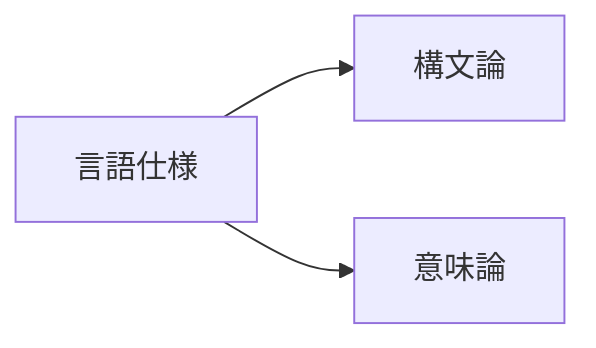
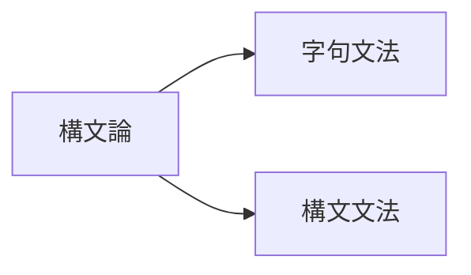
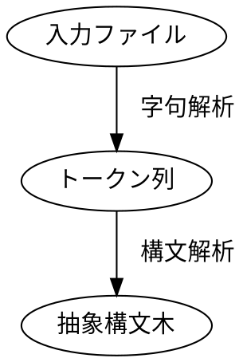
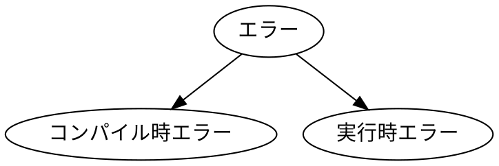

**構文論(syntax)**：どんな記号列がその言語のプログラムたり得るか？

**意味論(semantic)**：プログラムがどんな動作をするか？

## 構文論

**字句文法(lexical grammar)**：どういった文字の並びがその言語の単語(トークン:token)となるか？

**構文文法(syntactic grammar)**：どういったトークンの並びがプログラムたりえるか？

コンパイラ

#### BNF (Backus-Naur Form)

文脈自由文法の生成規則

生成規則の右辺

左辺

文脈自由文法

#### 字句文法

- 空白文字
- コメント
- 識別子と予約語
- 各種定数
- その他記号

#### 構文文法

## エラー

#### 構文エラー

#### 型と型に関するエラー